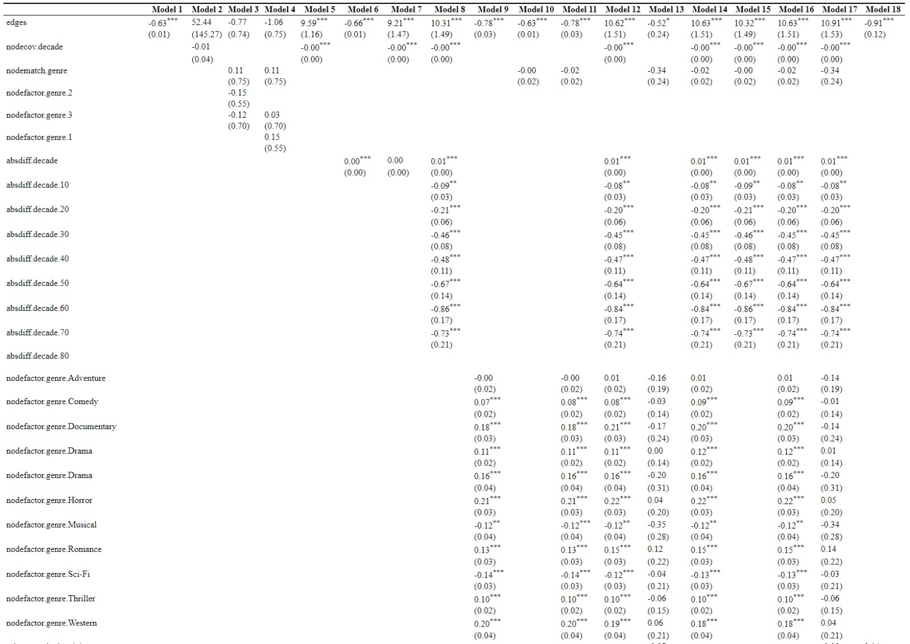
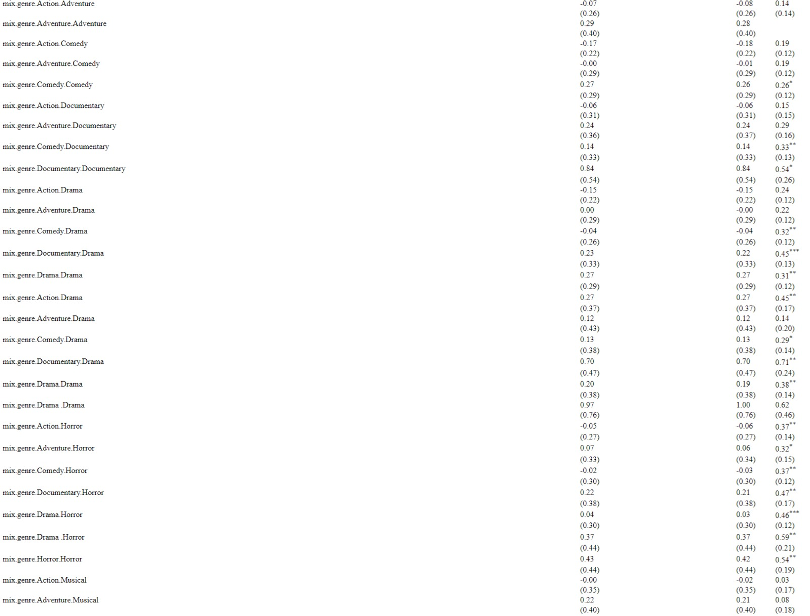
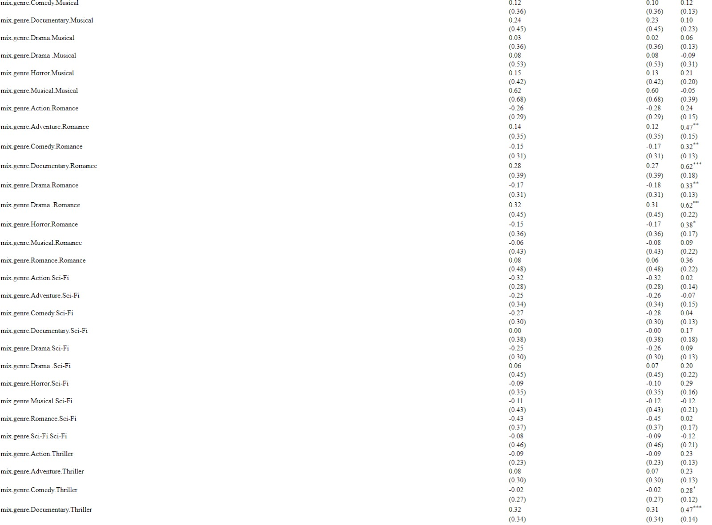
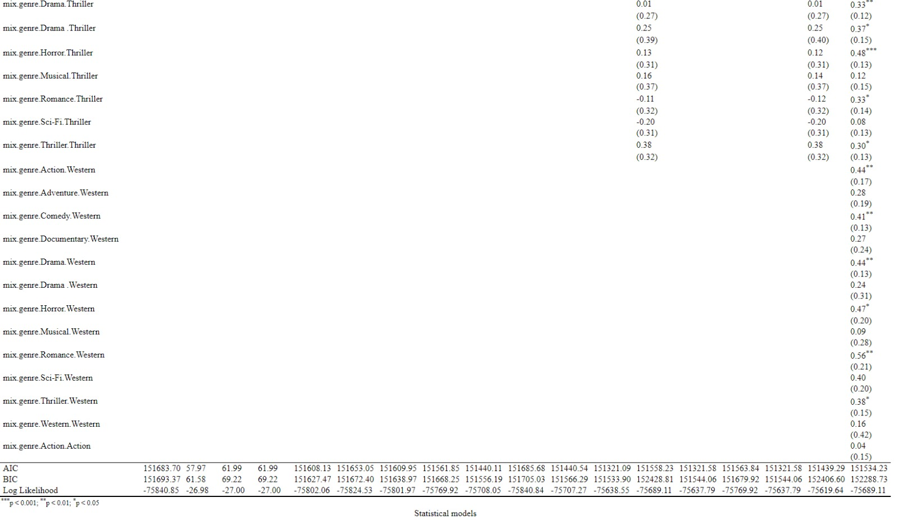
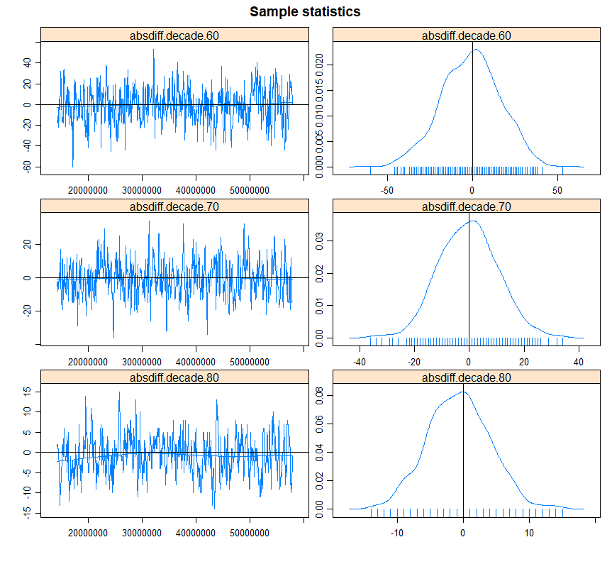
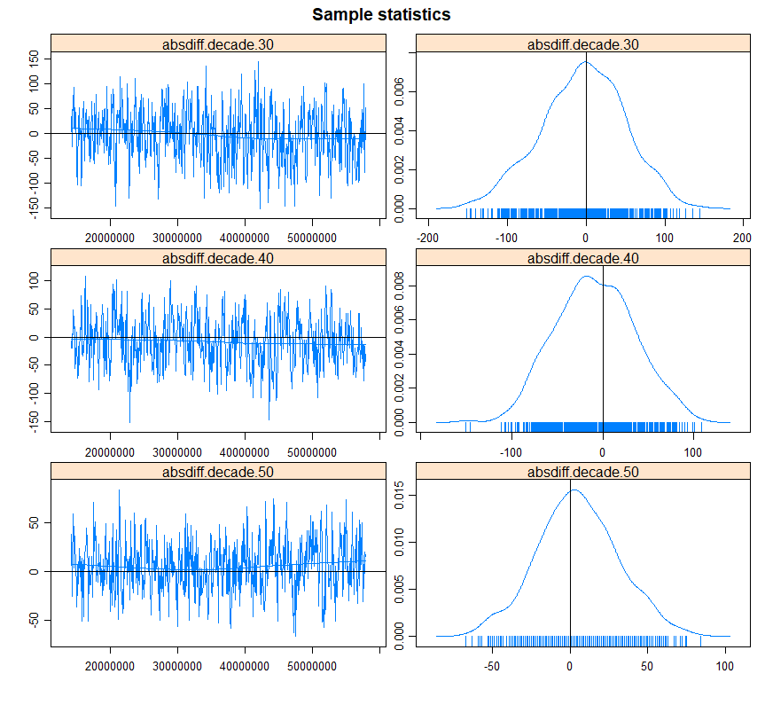
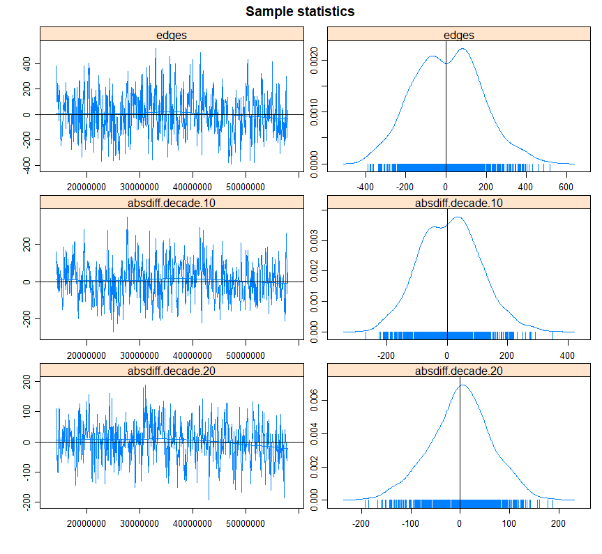

```{r setup, include = FALSE}
library("papaja")
r_refs("r-references.bib")
source("same_size_ggplot.R")
library(ggplot2)
library(dplyr)
library(kableExtra)
library(scales)
library(gridExtra)
library(lubridate)
library(nycflights13)
library(tidyquant)
library(readxl)
```

```{r analysis-preferences, include = FALSE}
# Seed for random number generation
set.seed(42)
knitr::opts_chunk$set(cache.extra = knitr::rand_seed)
```


## Executive Summary 

In this research a light was shed on the question what the effects of genre on the likelihood of having two movies of the same genre watched is and how much liking the same movies would influence disliking the same movies (and vice versa).

Using a dataset with all movie reviews of the streaming site Netflix in the winter of 2001/2002 extended with own collected data about movie genres and release year, these questions were answered with a network perspective. Using QAP and ERGM the network of movie ratings by users are analysed.

It was found that homophily in both genre and the decade a movie came out were good predictors of an individual liking both movies. It was found that liking a movies was a better predictor for disliking movies compared to the effect the other way around.


## Introduction 
### Main topic
In this paper, we are going to study the presence of social networks within a movie streaming platform. We're focusing on the structure of links among a group of social players, which consist of users watching and rating movies on Netflix.  
Users of Netflix's movie recommendation algorithms are frequently given specific questions about their interests for certain items (which they provide by liking or disliking them, for example). These choices are then immediately integrated into the underlying learning system for future suggestions. If a recommender system starts promoting unwanted products after incorporating new preferences, the user may try to steer the system in the future by correcting it or supplying alternate preference information. 

### Importance
It is important to study the presence of these socials networks because this could potentially improve the recommender engine that this currently in place. For example, if you know that a user is likely to like a movie that other users with the same “liking profile” also like, you can recommend that movie to the user. When these connections are studied thoroughly, you could have a high probability that the recommendation is successful. This could have a large impact on a movie streaming platform. 

### Existing studies
In this paper, we will be looking into the Netflix Price Dataset. In 2006 Netflix decided to start a competition with a grand prize of 1 million US dollars. The goal of the competition was to create a collaborative filtering algorithm to predict user ratings for films, based on previous ratings without any other information about the users or films. In order to win you had to at least improve on Netflix's own algorithm by 10%. 
During the competition a lot of literature has emerged about the dataset and the competition. [@bell2007lessons; @takacs2008matrix; @narayanan2006break] 

However, no papers or any other literature can be found on network analysis on this dataset. We like to fill this gap in the literature by analysing the network and network structure that arises from the subset of the data that we will use. 
[@guillory2011simultaneous] developed an active movie recommendation system for Netflix. They found that a recommender system should not constantly ask questions to a user, because those reduces the user's mental image of how the recommendation system learns, prompting some participants to "lose track of what they were teaching". According to @amershi2014power, this was because users are not always eager to act as simple oracles (repeatedly telling the recommendation system whether they like something or not). This is interesting to take into account for our research, because this would mean that a social network within a movie recommendation system can never be fully exposed. 

### Research Questions and hypotheses
In this dataset, we can easily see connections between users and movies, but not between just the users or just the movies. At least not, when we do not include one or the other. That is why we have defined the following research questions:

* RQ1: What are the effects of the genre on the likelihood of having both movies watched by the same user?
* RQ2: How much does liking the same movies influence disliking the same movies, and vice versa? (In a network of frequent reviewers) 

In order to be able to answer these research questions, we have made set up the following hypothesis accordingly:

* Research Question 1:
  + Comparable movies, in terms of either genre and/or year, are more often watched by the same user than uncomparable movies.  
  + Movies of genre horror are generally rated higher than other movie genres.
* Research Question 2:
  + Users that like the same movies to a certain degree, are likely to dislike the same movies to that same degree 
  + Users that dislike the same movies to a certain degree, are likely to like the same movies to that same degree 

## Methodology

### Dataset 
During this study, the data that was shared by Netflix during the Netflix Prize open competition is used. The competition was about developing the best algorithm to predict user ratings for content on Netflix. The contest was started in order to improve their recommender system.

The data consisted of movies and account holders on Netflix who rated the movies on a 5 point scale. Also, the date the rating that was given and the year of the movie release are included in the dataset. Data was collected between October 1998 and December 2005 and the data consists of all ratings that were given during this period [@netflix_2019]. The initial dataset contains about 24 million ratings from over 480k users on almost 18k movies. [@takacs2008matrix]

For the movies, the dataset only contains the title of the movie and the year it was released. This was too little information about the movies for our project. Therefore, we decided to look for an additional data source to enrich the dataset. We used Amazon Prime movie genres to add genres to the dataset for further analysis.

The large size of the dataset made it difficult to work with and made running analysis models infeasable. Therefore, we decided to only use a selection of the ratings. The dataset has ratings from October 1998 to December 2005. For this analysis, only the data from December 2001, Januari 2002, and februari 2002 are considered. We chose this winter because this is the first time where users started to rate a good amount of movies while the number of ratings still did not completely explode yet.

To answer our two research questions we had to transform our data further in two different ways. For the first research question, the network is defined as movies for the nodes and the movies have an edge between them if there is an user that likes both movies. Liking a movie is defined as a user giving a 4 or 5 rating for a movie. Of course, modelling the network this way means that movies that are highly rated are always connect. Therefore, the network only included movies that have between 20 and 50 ratings. That means that our analysis only concerns niche movies with a small number of ratings. Moreover, there is a lower threshold too to make sure that we only include movies that have at least a few connections. All in all, the network is just under 500 nodes and the attributes for the nodes are the year of release of the movie and the main movie genre that comes from Amazon Prime.

In order to answer research questions about liking behaviour of customers on streaming platforms (such as Netflix) this dataset provides us with a great opportunity. The dataset contains a unusual amount of real, user generated data. Datasets with similar types of data usually contain a lot less data and the large dataset is thus very useful in order to answer research questions about liking behaviour. [@takacs2008matrix]

As stated in the initial distribution of the data, Netflix can and will not guarantee the correctness of the data. As no perfect documentation of the data collection exists, this can cause inaccuracies in the results. Also, Netflix uses algorithms that determine what users see and this effect can influence the results of this research. We could interpret the effect of the algorithm as a effect caused by user behaviour.

#### Descriptives
```{r, echo=FALSE, warning=FALSE}
data <- read.csv("reviews_winter_2001_2002.csv")
data_genres <- read_excel("movie_movie_connections_node_list_genre.xlsx")

#sum_data <- summary(data)
#kable(sum_data)%>% kable_styling(position = "center")
```

Looking at the average Rating of the users in the data, the average rating they gave was about a $3,36$.
```{r, echo=FALSE, warning=FALSE}
sum <- do.call(data.frame, 
               list(mean = apply(data[3], 2, mean),
                    sd = apply(data[3], 2, sd),
                    min = apply(data[3], 2, min),
                    max = apply(data[3], 2, max),
                    n = apply(data[3], 2, length)))
    
kable(sum)%>% kable_styling(position = "center")
```

```{r, echo=FALSE, warning=FALSE}
data$Date_conv <- as.Date(data$Date)
data$day_of_week <- wday(data$Date_conv, label = TRUE, abbr = FALSE)
```

```{r, echo=FALSE, warning=FALSE}
per_day <- table(data$Date_conv)
```


Looking at the histogram of the amound of ratings given on a certain date we can see that a peak in ratings exists always in the middle of the week (around wednesday/thursday). Looking at the distribution of the ratings over time we don't see great differences. Over time, people give consistent ratings.

```{r, fig.height=8, fig.width=12, echo=FALSE, warning=FALSE}
p1 <- ggplot(data, aes(x = Date_conv, fill=day_of_week)) +
    geom_histogram(binwidth=0.5) + 
    scale_x_date(breaks=date_breaks(width="14 day")) + 
    xlab("Date") + ylab("Count ratings") +
    labs(title="Histogram of the amount of ratings given over time", fill="Day") +
    scale_fill_discrete(labels = c("Sunday", "Monday", "Tuesday", "Wednesday", "Thursday", "Friday", "Saturday")) +
    theme_minimal()

p2 <- ggplot(data, aes(x = Date_conv, group = as.factor(Rating), fill = as.factor(Rating))) + 
    stat_bin(binwidth=0.5, position = "fill") +
    scale_x_date(breaks=date_breaks(width="14 day")) + 
    xlab("Date") + ylab("Ratings (proportion)") +
    labs(title="Distribution of ratings per day over time", fill="Rating") +
    theme_minimal()

# Here we use a self made function that is in a separate Rscript file.
same.size.ggplot(c("p1", "p2"), "p2")

grid.arrange(p1, p2, ncol=1)
```

The genres in the data were determined using Amazone Prime. The first genre that Amazone Prime displayed is taken as the genre of the movie. As the genres that were displayed in Amazone Prime were not on alfabethic order, we assume that the first genre given is the main genre. 20 genres were found in the Netflix dataset. Most of the movies had *comedy* or *drama* as genre.

```{r, fig.height=4, fig.width=12, echo=FALSE, warning=FALSE}
ggplot(data_genres, aes(genre)) +
    geom_bar() +
    theme(axis.text.x = element_text(angle = 90, vjust = 0.3), 
          panel.background = element_rect(fill = "white")
          )
```

### Data analysis (Research Rationale)

#### QAP
In general, QAP is very interesting, when you have two or more networks and wants to compare those. In addition, we also choose QAP regression, since we thought it would be interesting to use this model, based on its permutation of actually observed graphs and therefore staying closer to the nature of our networks. 

There are three different QAP models from which one had to be chosen for our data and research question. The first is the simple QAP test where you measure the association between two networks. Furthermore, there is a QAP linear model, which can be used on a valued dependent network and one or more explanatory networks. Finally, there is the QAP logistic model, which differs from the linear model, in terms of a binary-valued dependent network. 

Our weights in our network are not binary so the logistic model is not an option for us. Even though, we only have two networks we decided to go for the linear model since we would like to see if we could “explain” the first network with the second and vice versa.

As QAP is the only method (to our knowledge) that is able to compare two networks to each other, there aren't any other methods available to address the second research question.

#### ERGM
Many metrics like density and centrality are used to describe the structural characteristics of an observed network. These metrics, on the other hand, describe the observed network, which is just one of many possible alternative networks. The structural characteristics of this group of alternative networks may or may not be similar. A statistical model must consider the set of all possible alternative networks weighted in their similarity to an observed network to credit a statistical inference about the processes that influence the formation of network structures. 

Network data, on the other hand, violates the independence and identical distribution assumptions of statistical models like linear regression because they are inherently relational. Alternative statistical models must reflect the uncertainty associated with a given observation, allow inference about the relative frequency of theoretically important network substructures, eliminate ambiguities in the influence of confounding processes, efficiently represent complex structures, and link local-level processes with global-level properties. For example, degree-preserving randomization is a method of considering an observed network in terms of multiple alternative networks. 

Exponential Random Graph models (ERGM) is a powerful technique for conducting statistical inference on network data. ERGM is a good choice as a network modelling framework for cases where the outcome of interest is in the presence or absence of edges. That makes it a suitable method for our research question, because .... AANVULLEN

## Results

### QAP Model

#### Constructing data and the model
During preprocessing of the data, an interesting artifact was encountered; When users were removed from the dataset that either liked or disliked a movie, it was clearly shown that it occurred much more often that user gave a 4/5 star rating to a movie than a 1/2 star rating. This is interesting to keep in mind, as this might pose a potential bias in the dataset.

To give a weight to the edges in terms of importance, we calculate the weight according to a formula: $weight = \frac{no. of mutual liked movies}{max(no. of liked movies)}$

#### Results
We have generated results for different (filtered) versions of the dataset. The results are explained and shown below.

##### More than 120 reviews
In order to get a feeling of the QAP regression model, and to get initial results in a reasonable amount of time, we first did the analysis on users who had 120 reviews in total(like and dislike) or more. The results are shown in the figure below. 
```{r echo = FALSE}
knitr::include_graphics("results120plus.png")
```

As can be seen from the figure, the QAP regression model explains only 6% of the variation in the like/dislike interaction network for movies when looking at liked movie ratings. When looking at disliked movie ratings, it becomes even less: 4%. 

##### More than 100 reviews
Next, we decreased the filter threshold for the number of ratings that users have given in the dataset. This increased the amount of datapoints in the dataset. So, we had a dataset with users who had 100 reviews in total (like and dislike) or more, and ran the analysis. The results are shown in the figure below.  

```{r echo = FALSE}
knitr::include_graphics("results100plus.png")
```

As can be seen from the figure, the QAP regression model explains only 9% of the variation in the like/dislike interaction network for movies when looking at liked movie ratings. When looking at disliked movie ratings, it becomes even less: 6%. 

##### More than 80 reviews
Because of the improved results in the last section, we decreased the filter threshold for the number of ratings that users have given in the dataset even more. This again increased the amount of datapoints in the dataset, and we did the analysis on users who had 80 reviews in total (like and dislike) or more. The results are shown in the figure below. 

```{r echo = FALSE}
knitr::include_graphics("results80plus.png")
```

As can be seen from the figure, the QAP regression model explains 14% of the variation in the like/dislike interaction network for movies when looking at liked movie ratings. When looking at disliked movie ratings, it again becomes a bit less: 10,4%. 

##### More than 60 reviews
For the last time, we decreased the filter threshold for the number of ratings that users have given in the dataset. This also increased the amount of datapoints in the dataset, and we ran the analysis on users who had 80 reviews in total (like and dislike) or more. The results are shown in the figure below. 

```{r echo = FALSE}
knitr::include_graphics("results60plus.png")
```

As can be seen from the figure, the QAP regression model explains 17% of the variation in the like/dislike interaction network for movies when looking at liked movie ratings. When looking at disliked movie ratings, the model can explain 13% of the variation. Th finally gave us the feeling that we are building somewhat meaningful models. 

We even wanted to go a step further and decrease the filter threshold for the number of ratings that users have given to 40. But this would yield a dataset that was too large to analyse, as it costs 25+ hours to run an analysis on it. 
 

#### Findings in relation to hypothesis

When relating our findings to our aforementioned hypothesis, we see that it is possible to build models that somewhat can explain the variance in the network in a significant way. However, we can clearly see that more data is not always giving better explanations. 

Also, it very interesting to see that liking movies says more about which movies you might dislike, than vice versa. An explanation for this might be that we saw in the data that there were more positive ratings than negative ratings, which could explain that disliking defines a more specific taste that is better detectable.

### ERGM 

In order to answer research question 1, an ERGM model has been used. The network created consists of movies as nodes. Two movies get an undirected edge if at least one user exists that has watched and liked both movies. An important assumption that is made is that a user liked a movie if the user has given a rating of at least four out of five. Next, in order to assess the influence of the release date, the decade of the release date is used. Furthermore, only the main genre of the movies have been used to assess the influence of two movies being watched by one user.

Homophily is hypothesized for genre and decade. Two movies with the same genre are more likely to have an edge and two movies from the same release decade are more likely to have an edge. Furthermore, the likeliness of an edge is even bigger when a movie has both the same genre and is from the same decade. To measure homophily the ERGM term Nodematch has been used. 


#### ERGM Models
A total of 18 ERGM models have been constructed with 9 different ERGM terms. These terms are a selection of most popular nodal covariate terms. Such as Nodecov, Absdiff, Nodefactor, Nodematch and Nodemix. A mixture of ERGM terms were required due to the difference in categorical and continuous variables. I.e. decade year and genre. The results from all models can be seen in the figure below. 

```{r model ergm, echo = FALSE}
# NOTE: EVERYTHING COMMENTED OUT DUE TO LONG RUN TIME. BUT KEPT IN DOCUMENT AS PROOF.
# NOTE: EVERYTHING COMMENTED OUT DUE TO LONG RUN TIME. BUT KEPT IN DOCUMENT AS PROOF.
# Source: ergm_1.R

#el <- read.csv("data_0512/edgelist.csv", header=T, as.is=T)
#attributes <- read.csv("data_0512/nodelist.csv", header=T, as.is=T)

# Create network
#net2 <- network::as.network(el, matrix.type="edgelist", directed=F)

# Add Node attributes
#net2 <- network::set.vertex.attribute(net2, 'genre', value = attributes$genre)
#net2 <- network::set.vertex.attribute(net2, 'decade', value = attributes$decade)

# Add Edge attribute
#net2 <- network::set.edge.attribute(net2, 'number_of_links', value = el$number_of_links)

# ERGM Statistical analyses (dyadic independent terms)
# <- ergm::ergm(net2 ~ edges)
#summary(model.01)

#model.01.1 <- ergm::ergm(net2 ~ density) # 10-15min run time
#summary(model.01.1)

# <- ergm::ergm(net2 ~ triangles) # 5-10min run time
#summary(model.01.2)


# this term adds one network statistic to the model, 
# equal to the number of ties incident on each actor beyond the first.
#model.02 <- ergm::ergm(net2 ~ concurrentties("genre")) # Ca. 5-10min
#summary(model.02)

#model.03 <- ergm::ergm(net2 ~ absdiffcat("decade"))
#summary(model.03)

#model.04 <- ergm::ergm(net2 ~ edges + absdiffcat("decade"))
#summary(model.04)

# Deploy ERGM models to experiment to which extent 
#   a movie made in a decade increases the probability of a movie being watches

# Nodecov is needed because undirected numeric var
# This means that an interaction between two dyad-independent terms can be 
# interpreted the same way as it would be in the corresponding logistic regression for each potential edge
#model.05 <- ergm::ergm(net2 ~ edges + nodecov("decade")) 
#summary(model.05)

# absdiff used to measure in terms of distance similarity
#model.06 <- ergm::ergm(net2 ~ edges + absdiff("decade")) 
#summary(model.06)

#model.06.1 <- ergm::ergm(net2 ~ edges + absdiffcat("decade")) 
#summary(model.06.1)

#model.07 <- ergm::ergm(net2 ~ edges + nodecov("decade") + absdiff("decade"))
#summary(model.07)

#model.08 <- ergm::ergm(net2 ~ edges + nodecov("decade") + absdiff("decade") + absdiffcat("decade"))
#summary(model.08)

# Nodefactor definitely used for Genre!
# Nodematch (Homophily) also used for Genre!
# Source: https://snanalyst.github.io/SNA4DS_2021_Slides/Lab_ERGM1.html#24
#model.09 <- ergm::ergm(net2 ~ edges + nodefactor("genre"))
#(model.09)

#model.10 <- ergm::ergm(net2 ~ edges + nodematch("genre"))
#summary(model.10)

#model.11 <- ergm::ergm(net2 ~ edges + nodemix("genre", base = c(1)))
#summary(model.11)
                      
#model.12 <- ergm::ergm(net2 ~ edges + nodefactor("genre") + nodematch("genre"))
#summary(model.12)

#model.13 <- ergm::ergm(net2 ~ edges + nodefactor("genre") + nodematch("genre") + nodemix("genre", base = c(1)))
#summary(model.13)


# Explanatory round (parameter 'diff=TRUE' werkt niet!!)
#model.12  <- ergm::ergm(net2 ~ edges + nodematch('genre', diff = FALSE) + nodefactor('genre'))
#summary(model.12)

# Continuous variables With nodefactor added
#model.14 <- ergm::ergm(net2 ~ edges + nodecov("decade") + absdiff("decade") + absdiffcat("decade") + nodefactor("genre"))
# (model.14)

# With nodematch added
#model.15 <- ergm::ergm(net2 ~ edges + nodecov("decade") + absdiff("decade") + absdiffcat("decade") + nodematch("genre"))
#summary(model.15)

# With nodefactor AND nodematch added
#model.16 <- ergm::ergm(net2 ~ edges + nodecov("decade") + absdiff("decade") + absdiffcat("decade")+ nodefactor("genre") + nodematch("genre"))
#summary(model.16)

# With nodefactor, nodematch and nodemix added
# model.17 <- ergm::ergm(net2 ~ edges + nodecov("decade") + absdiff("decade") + absdiffcat("decade")+ nodefactor("genre") + nodematch("genre") + nodemix("genre", base = c(1)))
# summary(model.17)


# Compare multiple models
# Lower AIC & BIC = better!
# comparing_models <- texreg::screenreg(list(model.01, model.02, model.03, model.04, model.05, model.06, model.07, model.08, model.09, model.10, model.11, model.12,  model.13, model.14, model.15, model.16, model.17, model.10.1))


# export to html
#texreg::htmlreg(list(model.01, model.02, model.03, model.04, model.05, model.06, model.10, model.11, model.12, model.13, model.14, model.15, model.16, model.17, model.10.1),file='models.html')


```





*Additonally, this model output can be found in directory "root/ergm_result/models.html".*

In order to find the best performing model, two model selection criteras have been used. The Akaike's Information Critera (AIC) and Bayesian Information Criteria (BIC). The AIC tries to measure high dimensional reality, while BIC selects model among a class of parametric models with different numbers of parameters (mainly in the domain of underfitting).
As can be seen from the figure, model 2, 3 and 4 yield the lowest AIC and BIC scores. 

The best performing was then used as input for the MCMC diagnostics and ERGM Goodness Of Fit.

Estimate parameters using Markov Chains Monte Carlo simulations. A Markov chain is a sequence of random variables that depends upon the value taken by the previous variable. This method then generates a series of graphs that differs from each other by only one edge.
The sequence of generated graphs, i.e. plots of Markov Chains Monte Carlo diagnostics are seen below.





#### Goodness of Fit (NOG AFMAKEN!!)
Goodness of fit calculates p-values for geodesic distance, degree, and reachability summaries to diagnose the goodness-of-fit of exponential family random graph models (Source: https://cran.r-project.org/web/packages/ergm/ergm.pdf).

The output is composed of 4 Parts:

1. Goodness-of-fit for degree
2. Goodness-of-fit for edgewise shared partner
3. Goodness-of-fit for minimum geodesic distance
4. Goodness-of-fit for model statistics

As can be seen from the result... 

#### Odds Ratio & Probabilities
An increase of one number of edges, decreased the log odds with -0.678. And it makes the odds of the effect 0.508 times larger. Odds ratio is below the 1 threshold, which means that there is a lower offs of forming edges in this network.

Additionally, for each decade year (10,20,30,40,50,60,70 and 80) the log odds increases with approximately 1.137. The odds of the effect increases accordingly to above the 1 threshold. Therefore it is concluded that having a movie made in a later year has a greater odds of multiple users rating the movie.

The best performing model has a 3.3% prob. of forming edges. However, decade 70 has 59% of forming an edge and decade 80, 78%. Which is consistent with the OR result.

#### ERGM Conclusion 
It appeared that both genre and decade affected the existence of an edge between nodes, hence confirming genre and decade as predictors for movies being liked by an individual. Furthermore, it became clear that adding terms to an ERGM can significantly improve results. By combining ERGM terms like Nodefactor, Nodematch, Nodecov, Absdiff and Nodemix, the best result was obtained. Therefore, the hypothesis was confirmed. 
The results are valuable for movie streaming services. By confirming that users that liked a movie, will be likely to also like movies from the same decade or genre, recommender systems can be improved. The results provide new insights in users’ taste of movies, which can be used by recommender systems to give better movie recommendations. For example, recommender systems could give recommendation towards movies, equal in decade or genre of previously liked movies.

## Conclusion

(about 350 words) – 0.7 POINTS
What were your topic and research questions again? (1 sentence)

What did you learn from the two analysis you run? *** most important point to 
address 0.5 POINTS here

### QAP

For the QAP model on the Netflix dataset the following research question was answered, namely “How much does liking the same movies influence disliking the same movies, and vice versa?”. For the second model, the users were the main focus instead of the movies.  

Netflix could have benefited from the insights derived by the research for their recommender systems back then. Even though old data is used, this could be replicated for more recent data. The insights gained were that networks on more enthusiastic reviewers do not give a clearer picture of their movie's taste. In addition, liking movies says more about which movies are possibly disliked, than vice versa.  

What remains an open problem would be to combine the movie genres in the user networks to give extra insights, connected to the first research question.

**Who benefits from your findings?**

**What does remain an open problem?**
What remains an open problem, is that we assume that a frequent reviewer gives a rating to a movie after watching it. However, we don’t have information on (re-)viewers that watch a movie but don’t give a rating afterwards. This is difficult to overcome as we simply don’t have data available on this matter.  


***Can you give suggestions for future work in this area?***
For future research it could be beneficial to dive more into the literature and find out more about what is already known in order to give a stronger reasoning behind the explanatory variables used in the analysis. Also, it would be interesting to look into more recent data as streaming services are widely used nowadays and the variation of users is maybe larger now.

\newpage

# References

\begingroup
\setlength{\parindent}{-0.5in}
\setlength{\leftskip}{0.5in}

<div id="refs" custom-style="Bibliography"></div>
\endgroup
