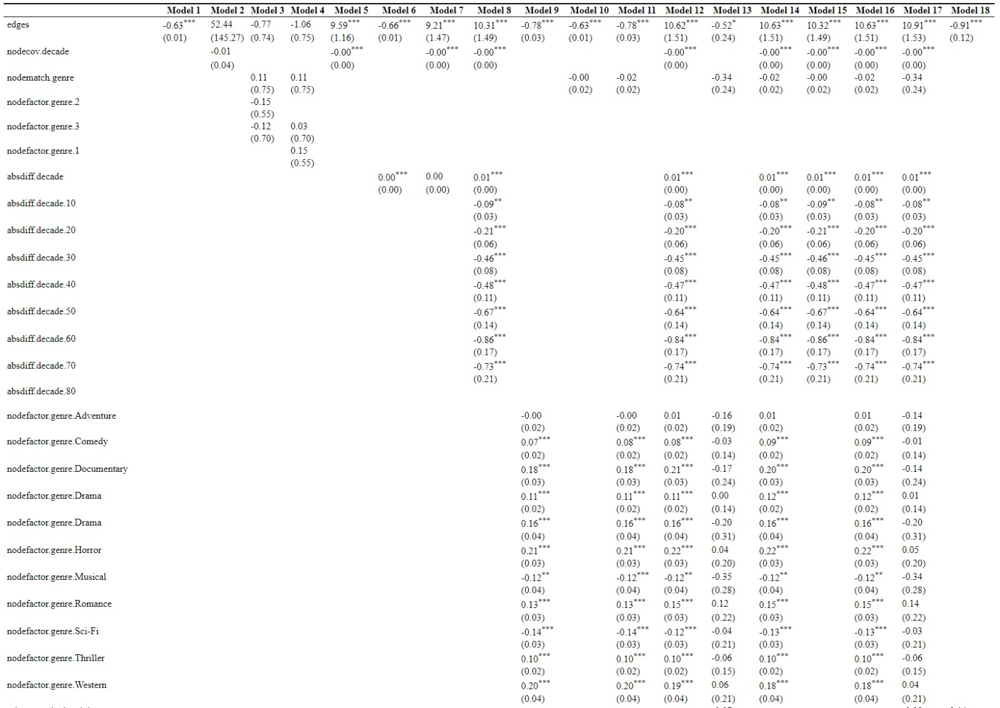
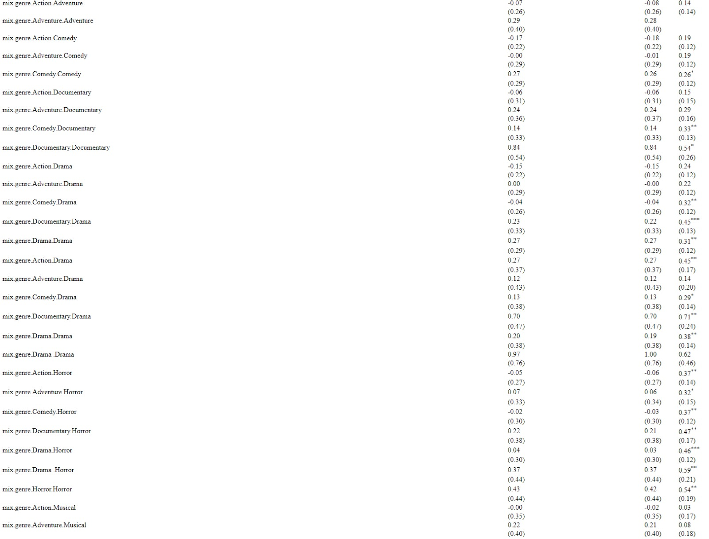
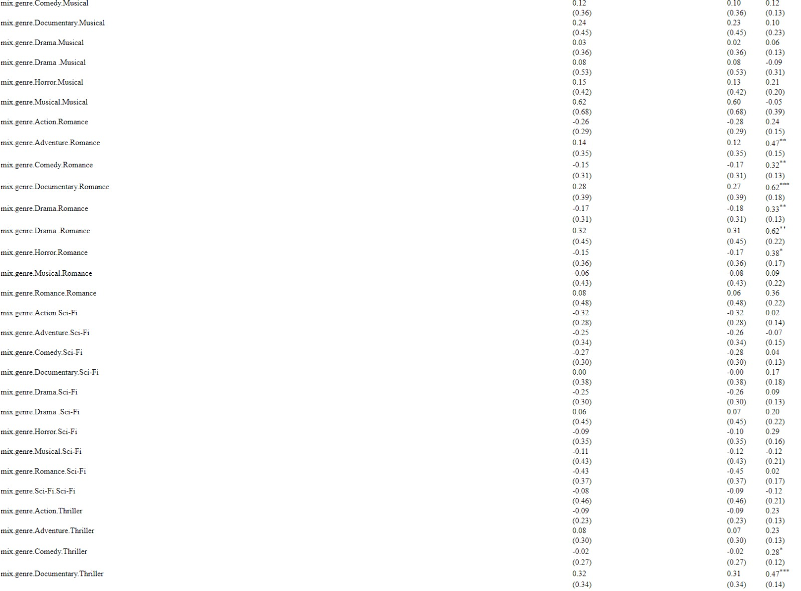
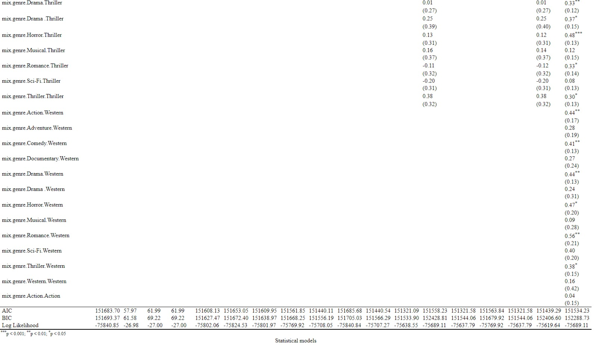

```{r setup, include = FALSE}
library("papaja")
r_refs("r-references.bib")
source("same_size_ggplot.R")
library(ggplot2)
library(dplyr)
library(kableExtra)
library(scales)
library(gridExtra)
library(lubridate)
library(nycflights13)
library(tidyquant)
# tinytex::install_tinytex()
```

```{r analysis-preferences, include = FALSE}
# Seed for random number generation
set.seed(42)
knitr::opts_chunk$set(cache.extra = knitr::rand_seed)
```


# Citations in papaja, detele appropriately later

Add the bibtex entry in the .bib file. You can find the entries in Google scholar, 
but double check since it is not always correct. 

Call the citations in the text:

Citation within parentheses	[@R-papaja]

Multiple citations	[@R-papaja; @R-base]

In-text citations	@R-papaja

Year only	[-@R-base]

Only if your citation appears in the text it will also show up in the Reference 
list. Don't manually modify the Reference list.

## Executive Summary 

(150 words) – 0.3 POINTS
Summarize the report. Write this as the very last thing.

What is the main topic you are addressing?

what are your research questions and hypotheses?  

what are your results and the main conclusion?


## Introduction 
### Main topic
In this paper, we are going to study the presence of social networks within a movie streaming platform. We're focusing on the structure of links among a group of social players, which consist of users watching and rating movies on Netflix.  
Users of Netflix's movie recommendation algorithms are frequently given specific questions about their interests for certain items (which they provide by liking or disliking them, for example). These choices are then immediately integrated into the underlying learning system for future suggestions. If a recommender system starts promoting unwanted products after incorporating new preferences, the user may try to steer the system in the future by correcting it or supplying alternate preference information. 

### Importance
It is important to study the presence of these socials networks because this could potentially improve the recommender engine that this currently in place. For example, if you know that a user is likely to like a movie that other users with the same “liking profile” also like, you can recommend that movie to the user. When these connections are studied thoroughly, you could have a high probability that the recommendation is successful. This could have a large impact on a movie streaming platform. 

### Existing studies
In this paper, we will be looking into the Netflix Price Dataset. In 2006 Netflix decided to start a competition with a grand prize of 1 million US dollars. The goal of the competition was to create a collaborative filtering algorithm to predict user ratings for films, based on previous ratings without any other information about the users or films. In order to win you had to at least improve on Netflix's own algorithm by 10%. 
During the competition a lot of literature has emerged about the dataset and the competition. [@bell2007lessons; @takacs2008matrix; @narayanan2006break] 

However, no papers or any other literature can be found on network analysis on this dataset. We like to fill this gap in the literature by analysing the network and network structure that arises from the subset of the data that we will use. 
[@guillory2011simultaneous] developed an active movie recommendation system for Netflix. They found that a recommender system should not constantly ask questions to a user, because those reduces the user's mental image of how the recommendation system learns, prompting some participants to "lose track of what they were teaching". According to @amershi2014power, this was because users are not always eager to act as simple oracles (repeatedly telling the recommendation system whether they like something or not). This is interesting to take into account for our research, because this would mean that a social network within a movie recommendation system can never be fully exposed. 

### Questions and hypotheses
In this dataset, we can easily see connections between users and movies, but not between just the users or just the movies. At least not, when we do not include one or the other. 

## Methodology

### Dataset 
During this study, the data that was shared by Netflix during the Netflix Prize open competition is used. The competition was about developing the best algorithm to predict user ratings for content on Netflix. The contest was started in order to improve their recommender system.

The data consisted of movies and account holders on Netflix who rated the movies on a 5 point scale. Also, the date the rating that was given and the year of the movie release are included in the dataset. Data was collected between October 1998 and December 2005 and the data consists of all ratings that were given during this period. (REF: KAGGLE) The initial dataset contains about 100 million ratings from over 480k users on almost 18k movies. (REF: Matrix Factorization and Neighbor Based Algorithms for the Netflix Prize Problem)

In order to answer research questions about liking behaviour of customers on streaming platforms (such as Netflix) this dataset provides us with a great opportunity. The dataset contains a unusual amount of real, user generated data. Datasets with similar types of data usually contain a lot less data and the large dataset is thus very useful in order to answer research questions about liking behaviour. (REF: Matrix Factorization and Neighbor Based Algorithms for the Netflix Prize Problem)

As stated in the initial distribution of the data, Netflix can and will not guarantee the correctness of the data. As no perfect documentation of the data collection exists, this can cause inaccuracies in the results. Also, Netflix uses algorithms that determine what users see and this effect can influence the results of this research. We could interpret the effect of the algorithm as a effect caused by user behaviour.

#### Descriptives

Looking at the histogram of the amount of ratings given on a certain date we can see that a peak in ratings exists always in the middle of the week (around wednesday/thursday). Looking at the distribution of the ratings over time we don't see great differences. Over time, people give consistent ratings.
arrange(p1, p2, ncol=1)


### Data analysis (Research Rationale)
(about 500 words) – 1 POINTS
*	Why are these two methods suitable for your data?

*	Why are these two methods suitable for your research questions?

*	Are there other methods to address these questions? If yes, why are the 
methods you chose better for this case?


## Results

(about 2000 words)

Wat voor tekst moeten wij hier typen??

### QAP Model
(about 1000 words) – 2.5 POINTS

#### Constructing data and the model
During preprocessing of the data, an interesting artifact was encountered; When users were removed from the dataset that either liked or disliked a movie, it was clearly shown that it occurred much more often that user gave a 4/5 star rating to a movie than a 1/2 star rating. This is interesting to keep in mind, as this might pose a potential bias in the dataset.

To give a weight to the edges in terms of importance, we calculate the weight according to a formula: 

#### Results
*	Present your results appropriately (plots, tables…) and discuss your findings 
in plain English

#### Findings in relation to hypothesis


*	Discuss the meaning of your findings in relation to your hypothesis. (half of
the points evaluated in this other part)


```{r echo = FALSE, results = 'asis'}
# table example
cn <- c("age", "gender", "eyes_col")
one <- c(7, "M", "BLUE")
two <- c(8, "F", "BROWN")
three <- c(8, "M", "GREEN")
four <- c(7, "F", "PINK")

tab <- rbind(cn, one, two, three, four)
rownames(tab) <- NULL
knitr::kable(tab)
```


### ERGM 
(about 1000) – 2.5 POINTS

In order to answer this research question, an ERGM model has been used. The netwerk created consists of movies as nodes. Two movies get an undirected edge if at least one user exists that has watched and liked both movies. An important assumption that is made is that a user liked a movie if the user has given a rating of at least four out of five. Next, in order to assess the influence of the release date, the decade of the release date is used. Furthermore, only the main genre of the movies have been used to assess the influence of two movies being watched by one user.

Homophily is hypothesized for genre and decade. Two movies with the same genre are more likely to have an edge and two movies from the same release decade are more likely to have an edge. Furthermore, the likeliness of an edge is even bigger when a movie has both the same genre and is from the same decade.

#### The Genre
To start off, the effect of genre on the likelihood of an edge between movies will be explored. 


```{r model ergm, echo = FALSE}
el <- read.csv("data_0512/edgelist.csv", header=T, as.is=T)
attributes <- read.csv("data_0512/nodelist.csv", header=T, as.is=T)

# Create network
net2 <- network::as.network(el, matrix.type="edgelist", directed=F)

# Add Node attributes
net2 <- network::set.vertex.attribute(net2, 'genre', value = attributes$genre)
net2 <- network::set.vertex.attribute(net2, 'decade', value = attributes$decade)

# Add Edge attribute
net2 <- network::set.edge.attribute(net2, 'number_of_links', value = el$number_of_links)

# ERGM Statistical analyses (dyadic independent terms)
#model.01 <- ergm::ergm(net2 ~ edges)
#summary(model.01)

#model.01.1 <- ergm::ergm(net2 ~ density) # 10-15min run time
#summary(model.01.1)

#model.01.2 <- ergm::ergm(net2 ~ triangles) # 5-10min run time
#summary(model.01.2)


```
#### ERGM Model results






* Present your results appropriately (plots, tables…) and discuss your findings 
in plain English

* Discuss the meaning of your findings in relation to your hypothesis. (half of 
the points evaluated in this other part)


Option to showcase a model:

```{r model 2, echo = FALSE, results = 'asis'}
# model results display example
ctl <- c(4.17,5.58,5.18,6.11,4.50,4.61,5.17,4.53,5.33,5.14)
trt <- c(4.81,4.17,4.41,3.59,5.87,3.83,6.03,4.89,4.32,4.69)
group <- gl(2, 10, 20, labels = c("Ctl","Trt"))
weight <- c(ctl, trt)
lm.D9 <- lm(weight ~ group)
lm.D90 <- lm(weight ~ group - 1)

# install.packages("texreg")

knitr::kable(texreg::matrixreg(list(lm.D9, lm.D90)))


```


Option 3

```{r model 3, echo = FALSE}
# model results display example
ctl <- c(4.17,5.58,5.18,6.11,4.50,4.61,5.17,4.53,5.33,5.14)
trt <- c(4.81,4.17,4.41,3.59,5.87,3.83,6.03,4.89,4.32,4.69)
group <- gl(2, 10, 20, labels = c("Ctl","Trt"))
weight <- c(ctl, trt)
lm.D9 <- lm(weight ~ group)
lm.D90 <- lm(weight ~ group - 1)

# install.packages("texreg")


texreg::plotreg(lm.D9)


```


Option 4

```{r model 4, echo = FALSE}
# model results display example
ctl <- c(4.17,5.58,5.18,6.11,4.50,4.61,5.17,4.53,5.33,5.14)
trt <- c(4.81,4.17,4.41,3.59,5.87,3.83,6.03,4.89,4.32,4.69)
group <- gl(2, 10, 20, labels = c("Ctl","Trt"))
weight <- c(ctl, trt)
lm.D9 <- lm(weight ~ group)
lm.D90 <- lm(weight ~ group - 1)

# install.packages("texreg")

texreg::plotreg(list(lm.D9, lm.D90))

```


## Conclusion

(about 350 words) – 0.7 POINTS
What were your topic and research questions again? (1 sentence)

What did you learn from the two analysis you run? *** most important point to 
address 0.5 POINTS here

Who benefits from your findings?

What does remain an open problem?

Can you give suggestions for future work in this area?


\newpage

# References

\begingroup
\setlength{\parindent}{-0.5in}
\setlength{\leftskip}{0.5in}

<div id="refs" custom-style="Bibliography"></div>
\endgroup
