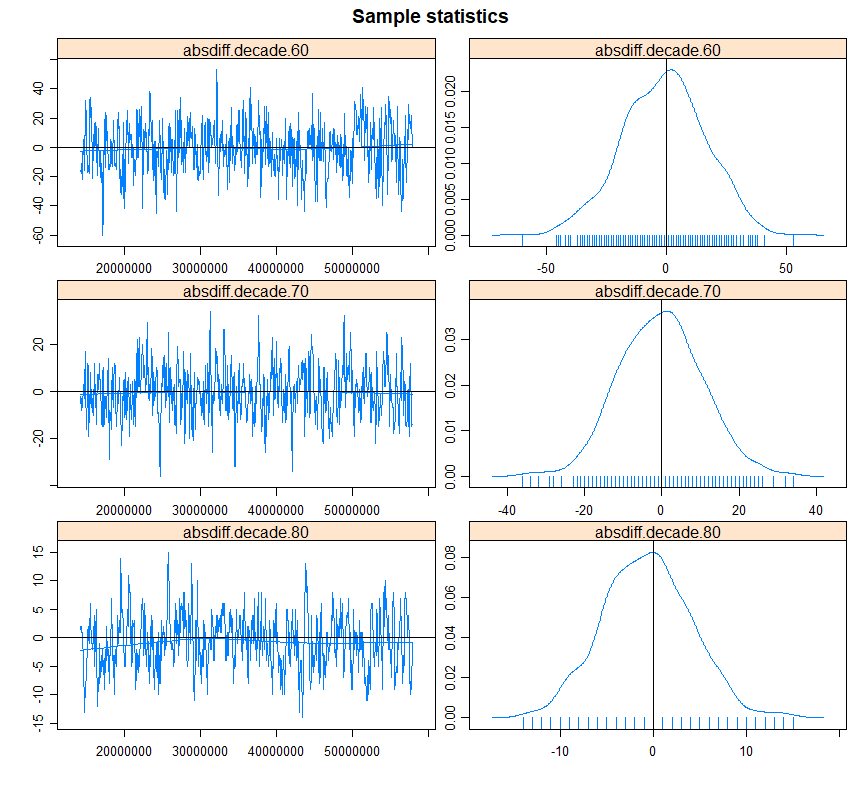

```{r setup, include = FALSE}
library("papaja")
r_refs("r-references.bib")
source("same_size_ggplot.R")
library(ggplot2)
library(dplyr)
library(kableExtra)
library(scales)
library(gridExtra)
library(lubridate)
library(nycflights13)
library(tidyquant)
# tinytex::install_tinytex()
```

```{r analysis-preferences, include = FALSE}
# Seed for random number generation
set.seed(42)
knitr::opts_chunk$set(cache.extra = knitr::rand_seed)
```


# Citations in papaja, detele appropriately later

Add the bibtex entry in the .bib file. You can find the entries in Google scholar, 
but double check since it is not always correct. 

Call the citations in the text:

Citation within parentheses	[@R-papaja]

Multiple citations	[@R-papaja; @R-base]

In-text citations	@R-papaja

Year only	[-@R-base]

Only if your citation appears in the text it will also show up in the Reference 
list. Don't manually modify the Reference list.

## Executive Summary 

(150 words) – 0.3 POINTS
Summarize the report. Write this as the very last thing.

What is the main topic you are addressing?

what are your research questions and hypotheses?  

what are your results and the main conclusion?


## Introduction 
### Main topic
In this paper, we are going to study the presence of social networks within a movie streaming platform. We're focusing on the structure of links among a group of social players, which consist of users watching and rating movies on Netflix.  
Users of Netflix's movie recommendation algorithms are frequently given specific questions about their interests for certain items (which they provide by liking or disliking them, for example). These choices are then immediately integrated into the underlying learning system for future suggestions. If a recommender system starts promoting unwanted products after incorporating new preferences, the user may try to steer the system in the future by correcting it or supplying alternate preference information. 

### Importance
It is important to study the presence of these socials networks because this could potentially improve the recommender engine that this currently in place. For example, if you know that a user is likely to like a movie that other users with the same “liking profile” also like, you can recommend that movie to the user. When these connections are studied thoroughly, you could have a high probability that the recommendation is successful. This could have a large impact on a movie streaming platform. 

### Existing studies
In this paper, we will be looking into the Netflix Price Dataset. In 2006 Netflix decided to start a competition with a grand prize of 1 million US dollars. The goal of the competition was to create a collaborative filtering algorithm to predict user ratings for films, based on previous ratings without any other information about the users or films. In order to win you had to at least improve on Netflix's own algorithm by 10%. 
During the competition a lot of literature has emerged about the dataset and the competition. [@bell2007lessons; @takacs2008matrix; @narayanan2006break] 

However, no papers or any other literature can be found on network analysis on this dataset. We like to fill this gap in the literature by analysing the network and network structure that arises from the subset of the data that we will use. 
[@guillory2011simultaneous] developed an active movie recommendation system for Netflix. They found that a recommender system should not constantly ask questions to a user, because those reduces the user's mental image of how the recommendation system learns, prompting some participants to "lose track of what they were teaching". According to @amershi2014power, this was because users are not always eager to act as simple oracles (repeatedly telling the recommendation system whether they like something or not). This is interesting to take into account for our research, because this would mean that a social network within a movie recommendation system can never be fully exposed. 


## Results

(about 2000 words)

Wat voor tekst moeten wij hier typen??


### ERGM 
(about 1000) – 2.5 POINTS

*What are the effects of the genre and release date on two movies being liked by one user?*
In order to answer this research question, an ERGM model has been used. The network created consists of movies as nodes. Two movies get an undirected edge if at least one user exists that has watched and liked both movies. An important assumption that is made is that a user liked a movie if the user has given a rating of at least four out of five. Next, in order to assess the influence of the release date, the decade of the release date is used. Furthermore, only the main genre of the movies have been used to assess the influence of two movies being watched by one user.

Homophily is hypothesized for genre and decade. Two movies with the same genre are more likely to have an edge and two movies from the same release decade are more likely to have an edge. Furthermore, the likeliness of an edge is even bigger when a movie has both the same genre and is from the same decade. To measure homophily the ERGM term Nodematch has been used. 


#### ERGM Models
A total of 18 ERGM models have been constructed with 9 different ERGM terms. These terms are a selection of most popular nodal covariate terms. Such as Nodecov, Absdiff, Nodefactor, Nodematch and Nodemix. A mixture of ERGM terms were required due to the difference in categorical and continuous variables. I.e. decade year and genre. The results from all models can be seen in the figure below. 


```{r model ergm, echo = FALSE}
# NOTE: EVERYTHING COMMENTED OUT DUE TO LONG RUN TIME. BUT KEPT IN DOCUMENT AS PROOF.
# NOTE: EVERYTHING COMMENTED OUT DUE TO LONG RUN TIME. BUT KEPT IN DOCUMENT AS PROOF.
# Source: ergm_1.R

#el <- read.csv("data_0512/edgelist.csv", header=T, as.is=T)
#attributes <- read.csv("data_0512/nodelist.csv", header=T, as.is=T)

# Create network
#net2 <- network::as.network(el, matrix.type="edgelist", directed=F)

# Add Node attributes
#net2 <- network::set.vertex.attribute(net2, 'genre', value = attributes$genre)
#net2 <- network::set.vertex.attribute(net2, 'decade', value = attributes$decade)

# Add Edge attribute
#net2 <- network::set.edge.attribute(net2, 'number_of_links', value = el$number_of_links)

# ERGM Statistical analyses (dyadic independent terms)
# <- ergm::ergm(net2 ~ edges)
#summary(model.01)

#model.01.1 <- ergm::ergm(net2 ~ density) # 10-15min run time
#summary(model.01.1)

# <- ergm::ergm(net2 ~ triangles) # 5-10min run time
#summary(model.01.2)


# this term adds one network statistic to the model, 
# equal to the number of ties incident on each actor beyond the first.
#model.02 <- ergm::ergm(net2 ~ concurrentties("genre")) # Ca. 5-10min
#summary(model.02)

#model.03 <- ergm::ergm(net2 ~ absdiffcat("decade"))
#summary(model.03)

#model.04 <- ergm::ergm(net2 ~ edges + absdiffcat("decade"))
#summary(model.04)

# Deploy ERGM models to experiment to which extent 
#   a movie made in a decade increases the probability of a movie being watches

# Nodecov is needed because undirected numeric var
# This means that an interaction between two dyad-independent terms can be 
# interpreted the same way as it would be in the corresponding logistic regression for each potential edge
#model.05 <- ergm::ergm(net2 ~ edges + nodecov("decade")) 
#summary(model.05)

# absdiff used to measure in terms of distance similarity
#model.06 <- ergm::ergm(net2 ~ edges + absdiff("decade")) 
#summary(model.06)

#model.06.1 <- ergm::ergm(net2 ~ edges + absdiffcat("decade")) 
#summary(model.06.1)

#model.07 <- ergm::ergm(net2 ~ edges + nodecov("decade") + absdiff("decade"))
#summary(model.07)

#model.08 <- ergm::ergm(net2 ~ edges + nodecov("decade") + absdiff("decade") + absdiffcat("decade"))
#summary(model.08)

# Nodefactor definitely used for Genre!
# Nodematch (Homophily) also used for Genre!
# Source: https://snanalyst.github.io/SNA4DS_2021_Slides/Lab_ERGM1.html#24
#model.09 <- ergm::ergm(net2 ~ edges + nodefactor("genre"))
#(model.09)

#model.10 <- ergm::ergm(net2 ~ edges + nodematch("genre"))
#summary(model.10)

#model.11 <- ergm::ergm(net2 ~ edges + nodemix("genre", base = c(1)))
#summary(model.11)
                      
#model.12 <- ergm::ergm(net2 ~ edges + nodefactor("genre") + nodematch("genre"))
#summary(model.12)

#model.13 <- ergm::ergm(net2 ~ edges + nodefactor("genre") + nodematch("genre") + nodemix("genre", base = c(1)))
#summary(model.13)


# Explanatory round (parameter 'diff=TRUE' werkt niet!!)
#model.12  <- ergm::ergm(net2 ~ edges + nodematch('genre', diff = FALSE) + nodefactor('genre'))
#summary(model.12)

# Continuous variables With nodefactor added
#model.14 <- ergm::ergm(net2 ~ edges + nodecov("decade") + absdiff("decade") + absdiffcat("decade") + nodefactor("genre"))
# (model.14)

# With nodematch added
#model.15 <- ergm::ergm(net2 ~ edges + nodecov("decade") + absdiff("decade") + absdiffcat("decade") + nodematch("genre"))
#summary(model.15)

# With nodefactor AND nodematch added
#model.16 <- ergm::ergm(net2 ~ edges + nodecov("decade") + absdiff("decade") + absdiffcat("decade")+ nodefactor("genre") + nodematch("genre"))
#summary(model.16)

# With nodefactor, nodematch and nodemix added
# model.17 <- ergm::ergm(net2 ~ edges + nodecov("decade") + absdiff("decade") + absdiffcat("decade")+ nodefactor("genre") + nodematch("genre") + nodemix("genre", base = c(1)))
# summary(model.17)


# Compare multiple models
# Lower AIC & BIC = better!
# comparing_models <- texreg::screenreg(list(model.01, model.02, model.03, model.04, model.05, model.06, model.07, model.08, model.09, model.10, model.11, model.12,  model.13, model.14, model.15, model.16, model.17, model.10.1))


# export to html
#texreg::htmlreg(list(model.01, model.02, model.03, model.04, model.05, model.06, model.10, model.11, model.12, model.13, model.14, model.15, model.16, model.17, model.10.1),file='models.html')


```
#### ERGM Model coefficients result


*Additonally, this model output can be found in directory "root/ergm_result/models.html".*

In order to find the best performing model, two model selection criteras have been used. The Akaike's Information Critera (AIC) and Bayesian Information Criteria (BIC). The AIC tries to measure high dimensional reality, while BIC selects model among a class of parametric models with different numbers of parameters (mainly in the domain of underfitting).
As can be seen from the figure, model 2, 3 and 4 yield the lowest AIC and BIC scores. 

The best performing was then used as input for the MCMC diagnostics and ERGM Goodness Of Fit.

Estimate parameters using Markov Chains Monte Carlo simulations. A Markov chain is a sequence of random variables that depends upon the value taken by the previous variable. This method then generates a series of graphs that differs from each other by only one edge.
The sequence of generated graphs, i.e. plots of Markov Chains Monte Carlo diagnostics are seen below.

MCMC sample size has been kept at a relative low number of 500 due to computational time.




#### Goodness of Fit
Goodness of fit calculates p-values for geodesic distance, degree, and reachability summaries to diagnose the goodness-of-fit of exponential family random graph models (Source: https://cran.r-project.org/web/packages/ergm/ergm.pdf).

The output is composed of 4 Parts:

1. Goodness-of-fit for degree
2. Goodness-of-fit for edgewise shared partner
3. Goodness-of-fit for minimum geodesic distance
4. Goodness-of-fit for model statistics

As can be seen from the result, 

*Result can be found in best_model_gof.txt*


#### Odds Ratio & Probabilities
An increase of one number of edges, decreased the log odds with -0.678. And it makes the odds of the effect 0.508 times larger. Odds ratio is below the 1 threshold, which means that there is a lower offs of forming edges in this network.

Additionally, for each decade year (10,20,30,40,50,60,70 and 80) the log odds increases with approximately 1.137. The odds of the effect increases accordingly to above the 1 threshold. Therefore it is concluded that having a movie made in a later year has a greater odds of multiple users rating the movie.

The best performing model has a 3.3% prob. of forming edges. However, decade 70 has 59% of forming an edge and decade 80, 78%. Which is consistent with the OR result.

*Result can be found in best_model_odds_ratio.txt & best_model_prob.txt*

## Conclusion

(about 350 words) – 0.7 POINTS
What were your topic and research questions again? (1 sentence)

What did you learn from the two analysis you run? *** most important point to 
address 0.5 POINTS here

Who benefits from your findings?

What does remain an open problem?

Can you give suggestions for future work in this area?

--> Iets met Weighted ERGM. Bijv: GERGM model. En meer features van users/movies.


\newpage

# References

\begingroup
\setlength{\parindent}{-0.5in}
\setlength{\leftskip}{0.5in}

<div id="refs" custom-style="Bibliography"></div>
\endgroup
